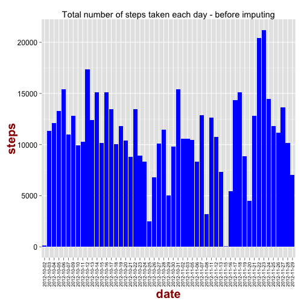
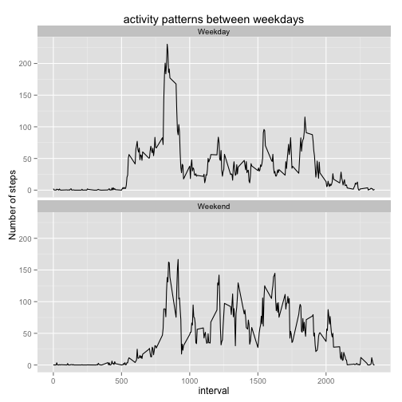

####Loading and preprocessing the data

Load the plotting2 package that we are going to use for making graphs.
Load the stringr package for string manipulations.


```r
library(ggplot2)
library(stringr)
```


1. Load the data (i.e. read.csv()):


```r
activity <- read.csv("activity.csv", header=T )
```

2. Process/transform the data (if necessary) into a format suitable for your analysis.

Here we have added the steps for each day and store in the "daily_step" dataframe.


```r
daily_step <- aggregate(steps ~ date, data = activity, sum, na.rm = TRUE)
```
---------

####What is mean total number of steps taken per day?
1. Make a histogram of the total number of steps taken each day.


The graph shows the total number steps for day: 


```r
bp <- ggplot(data=daily_step, aes(x=date, y=steps)) + geom_bar(stat="identity", fill="blue")
bp + theme(axis.title.x = element_text(face="bold", colour="#990000", size=20),
      axis.text.x  = element_text(angle=90, vjust=0.5, size=8, colour="black")) + 
      theme(axis.title.y = element_text(face="bold", colour="#990000", size=20),
           axis.text.y  = element_text(vjust=0.5, size=12, colour = "black")) + ggtitle("Total number of steps taken each day - before imputing")
```

 

2. Calculate and report the mean and median total number of steps taken per day

daily mean:

```r
mean(daily_step$steps)
```

```
## [1] 10766
```

daily median


```r
median(daily_step$steps)
```

```
## [1] 10765
```

####What is the average daily activity pattern?
1. Make a time series plot (i.e. type = "l") of the 5-minute interval (x-axis) and the average number of steps taken, averaged across all days (y-axis).


This will average over the days for each time interval:


```r
interval_step <- aggregate(steps ~ interval, data = activity, mean, na.rm = TRUE)
```

Graph for the time intervals:


```r
ggplot(data=interval_step, aes(x=interval, y=steps)) + geom_line() + ggtitle("Average steps over the days for each time interval")
```

 

2. Which 5-minute interval, on average across all the days in the dataset, contains the maximum number of steps?


```r
interval_step[which.max(interval_step$steps), ][, 1]
```

```
## [1] 835
```


-------------------

####Imputing missing values

1. Calculate and report the total number of missing values in the dataset (i.e. the total number of rows with NAs)

```r
sum(is.na(activity$steps))
```

```
## [1] 2304
```


2. Devise a strategy for filling in all of the missing values in the dataset. The strategy does not need to be sophisticated. For example, you could use the mean/median for that day, or the mean for that 5-minute interval, etc.

#####Strategy for filling the missing values

In this case, I will be using the mean for the 5-minute intervals to fill the ```NAs```. 


Assign the dataset to a new dataframe called ```activity_imputed```:


```r
activity_imputed <- activity
```

This code will fill all ```NA```s with the mean for the 5-minute intervals:


```r
activity_imputed$steps[is.na(activity_imputed$steps)] <- with(activity_imputed,
        ave(steps,
        interval,
        FUN = function(x) mean(x, na.rm = TRUE)))[is.na(activity_imputed$step)]
```

3. Create a new dataset that is equal to the original dataset but with the missing data filled in.

#####```activity_imputed``` is the new dataset with the missing data filled in. 

4. Make a histogram of the total number of steps taken each day and Calculate and report the mean and median total number of steps taken per day. Do these values differ from the estimates from the first part of the assignment? What is the impact of imputing missing data on the estimates of the total daily number of steps?

Following code will create a dataframe with the total number steps for day:


```r
daily_step_imputed <- aggregate(steps ~ date, data = activity_imputed, sum, na.rm = TRUE)
```

histogram of the total number of steps taken each day


```r
bp <- ggplot(data=daily_step_imputed, aes(x=date, y=steps)) + geom_bar(stat="identity", fill="brown")
bp + theme(axis.title.x = element_text(face="bold", colour="#990000", size=20),
           axis.text.x  = element_text(angle=90, vjust=0.5, size=8, colour="black")) + 
        theme(axis.title.y = element_text(face="bold", colour="#990000", size=20),
              axis.text.y  = element_text(vjust=0.5, size=12, colour = "black")) + ggtitle("Total number of steps taken each day - after imputing")
```

 

#####daily mean:


```r
mean(daily_step_imputed$steps)
```

```
## [1] 10766
```

#####daily median:


```r
median(daily_step_imputed$steps)
```

```
## [1] 10766
```

#####Imputing has no apparent impact on the mean. However, the median has slightly changed. Also, the median and the mean have become the same value after imputing. 


-----


####Are there differences in activity patterns between weekdays and weekends?


1. Create a new factor variable in the dataset with two levels – “weekday” and “weekend” indicating whether a given date is a weekday or weekend day.

Changing the ```Date``` column to ```R``` date format using ```as.Date()``` function:


```r
activity_imputed$date <- as.Date(as.character(activity_imputed$date), "%Y-%m-%d")
```


Create a new column ```week_day``` and assign weeks days:


```r
activity_imputed$week_day <- weekdays(activity_imputed$date) 
```


This code will assign ```Weekend``` if it is a Saturday or a Sunday. Otherwise, it will be ```Weekday```:


```r
activity_imputed$week <- ifelse(activity_imputed$week_day == "Saturday" | activity_imputed$week_day == "Sunday",
                                "Weekend", "Weekday")
```


Check if the code has worked:


```r
head(activity_imputed[activity_imputed$week_day == "Sunday", ], n=10)
```

```
##      steps       date interval week_day    week
## 1729     0 2012-10-07        0   Sunday Weekend
## 1730     0 2012-10-07        5   Sunday Weekend
## 1731     0 2012-10-07       10   Sunday Weekend
## 1732     0 2012-10-07       15   Sunday Weekend
## 1733     0 2012-10-07       20   Sunday Weekend
## 1734     0 2012-10-07       25   Sunday Weekend
## 1735     0 2012-10-07       30   Sunday Weekend
## 1736     0 2012-10-07       35   Sunday Weekend
## 1737     0 2012-10-07       40   Sunday Weekend
## 1738     0 2012-10-07       45   Sunday Weekend
```


Split the ```activity_imputed``` dataframe using ```Weekend``` and ```Weekday```:


```r
split_activity <- split(activity_imputed, activity_imputed$week)
```


This will calculate mean for each interval for ```Weekend``` and ```Weekday```, separately. 


```r
splitweekavg <- lapply(split_activity,
                 function(z) {
                         splitavg <- aggregate(steps ~ interval, data = z, mean, na.rm = TRUE)
                         return(splitavg)
                 })
```


Combine the split dataframe into one:


```r
weekavg <- do.call(rbind.data.frame, splitweekavg)
```


Rownames has been assigned to the ```activity_imputed$week``` column and we need to make the rownames column a separate column (```weekavg$week_dayas```) as this contains ```Weekend``` and ```Weekday``` categories:


```r
weekavg$week_day <- rownames(weekavg)
```


remove the rownames:


```r
rownames(weekavg) <- NULL
```


```Weekend``` and ```Weekday``` categories now contain a dot followed by a number and these need to be removed. Following code will reformat the ```weekavg$week_dayas``` column so it will only contain only ```Weekend``` and ```Weekday```:


```r
weekavg$week_day <- str_replace_all(weekavg$week_day,"Weekend.[0-9]","Weekend")
weekavg$week_day <- str_replace_all(weekavg$week_day,"Weekday.[0-9]","Weekday")
weekavg$week_day <- str_replace_all(weekavg$week_day,"\\d","")
```


2. Make a panel plot containing a time series plot (i.e. type = "l") of the 5-minute interval (x-axis) and the average number of steps taken, averaged across all weekday days or weekend days (y-axis). The plot should look something like the following, which was creating using simulated data:


```r
ggplot(data=weekavg, aes(x=interval, y=steps)) +ylab("Number of steps") + geom_line() + facet_wrap(~week_day, ncol=1) + ggtitle("activity patterns between weekdays")
```

 

